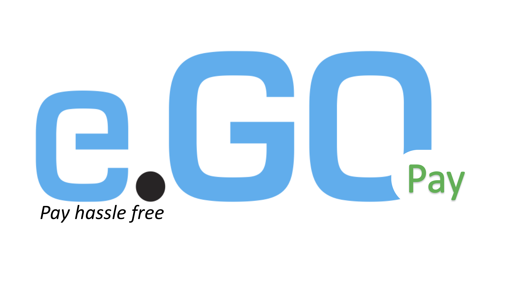

# Value-adding services 


Our services should support at least the following functions: 

- Intelligently choose the parking lot
  - location convenient
  - cheap price
  - support egoPay \@ref(fig:egoPay)
- Shortly reservation for the parking lot
  - estimating the arrival time
  - automatically reserve the parking space in advance
  - message notification
- Immediately payment -- egoPay
  - no worry about parking time
  - automatic charging fees while leaving
- Ego drive-thru 
  - food reservation from supermarket
  - food pick up from parking lotw
  - food payment by egoPay 
  
  
```{r, egoPay, fig.align='center', fig.cap="e.GO Pay logo" }

```


