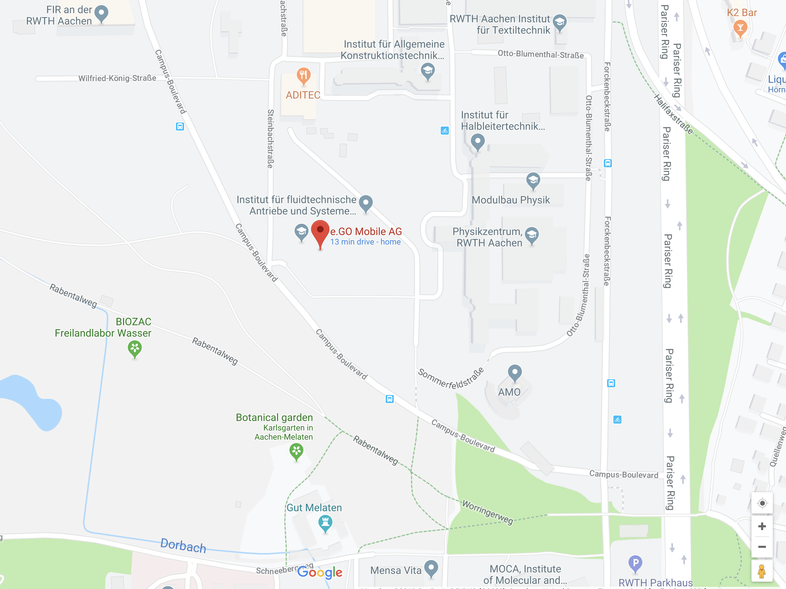
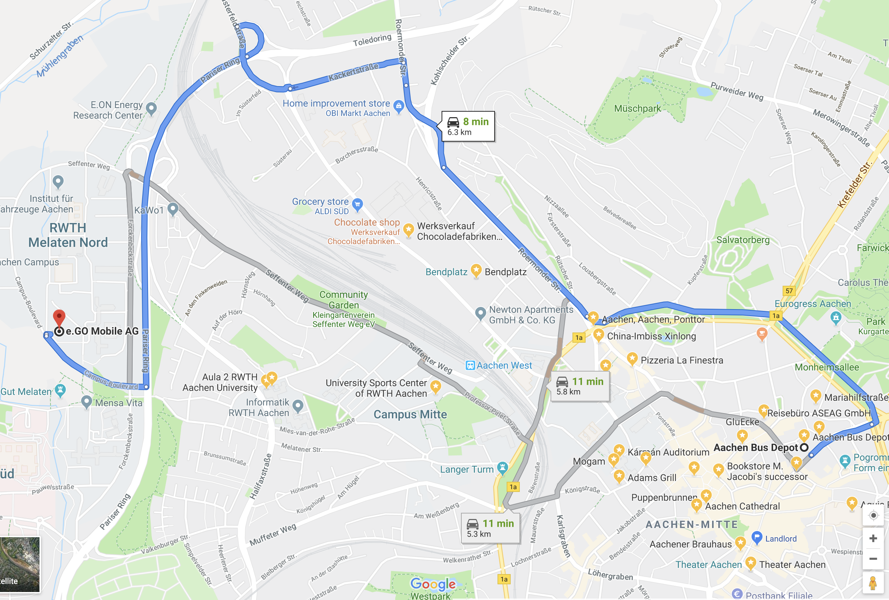

# Google Map Visulization

- Code to add marker and direction
```{python}
class GeoMaps:
    
    def __init__(self, curr_location):
        self.key = 'GoogleAPIKey'
        gmaps.configure(api_key=self.key)
        self.curr_location = curr_location
        self.fig = gmaps.figure(center=self.curr_location, zoom_level=12)
        
    def add_marker(self, marker_pos):
        markers = gmaps.marker_layer(marker_pos)
        self.fig.add_layer(markers)
        return self.fig
    
    def add_direction(self, origin, destination):
        to_destination = gmaps.directions_layer(origin, destination)
        self.fig.add_layer(to_destination)
        return self.fig
    
    def get_curr_location(self):
        return self.curr_location
    
    def update_location(self, new_location):
        self.curr_location = new_location
```

- Mark current location
```{r, marker, fig.align='center', fig.cap="google map with marker" }

```
- Draw car driving direction

```{r, direction, fig.align='center', fig.cap="google map with car driving direction" }

```
