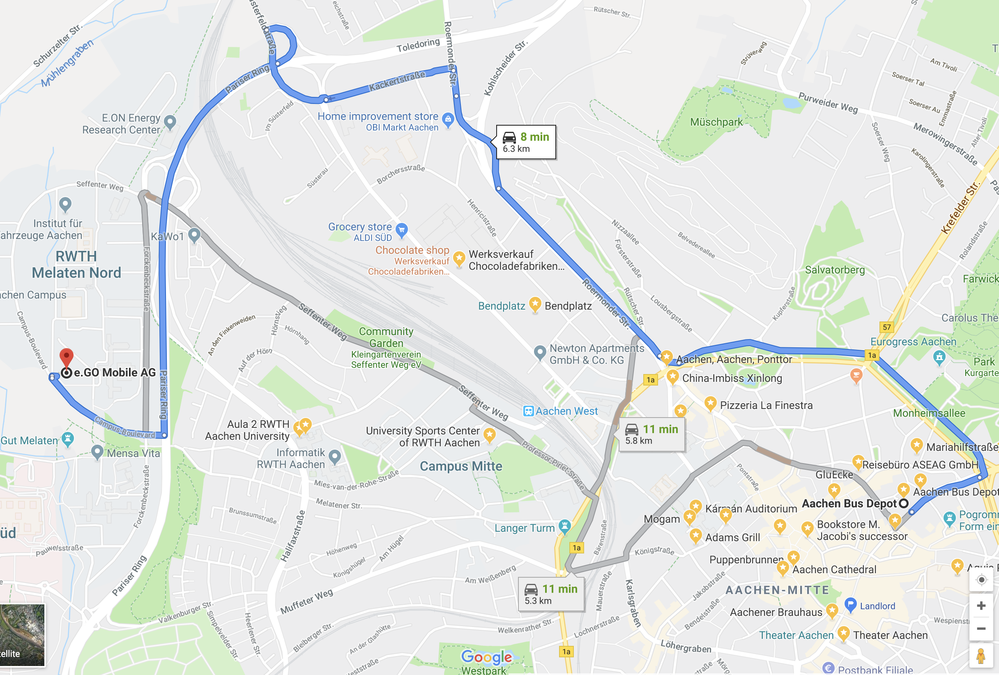

--- 
title: "e.GO Digital Hackathon"
author: "Team: Hugs for bugs (Xiaoqi, Yafei, Sachin, Venkatesh)"
date: "`r Sys.Date()`"
output:
  html_document:
    df_print: paged
description: This is a website demo for hachathon The output format for this example
  is bookdown::gitbook.
documentclass: book
link-citations: yes
bibliography: [book.bib]
site: bookdown::bookdown_site

---

# Background

Parking is understudied, yet imposes a similarly significant burden on drivers and the wider economy. In fact, this study shows nearly one in three drivers abandoned their search for a parking space at least once in the past year, as drivers spend an average of nearly nine minutes in pursuit of a coveted spot [@cookson2017impact].

**Problems**
- Searching for parking imposes a significant economic burden with drivers in the U.S., U.K. and Germany wasting 17, 44 and 41 hours a year respectively at an estimated cost of $72.7 billion, £23.3 billion and €40.4 billion a year in these countries.
- Unsurprisingly, the largest cities and major financial centers suffer the most with drivers in New York (107 hours), London (67 hours) and Frankfurt (65 hours) spending the most time searching for parking each year.
-  Paying for more parking time than required (“overpaying”) is a universal parking pain with drivers in the U.S., U.K. and Germany (costing $20.4 billion, £6.7 billion and €4.4 billion a year respectively).

**We need intelligent parking solutions -- e.GO Park & Pay**

```{r, egoPark, fig.align='center', fig.cap="e.GO Park logo" }
knitr::include_graphics("img/egoPark.png")
```

<!--chapter:end:index.Rmd-->

# Value-adding services 


Our services should support at least the following functions: 

- Intelligently choose the parking lot
  - location convenient
  - cheap price
  - support egoPay \@ref(fig:egoPay)
- Shortly reservation for the parking lot
  - estimating the arrival time
  - automatically reserve the parking space in advance
  - message notification
- Immediately payment -- egoPay
  - no worry about parking time
  - automatic charging fees while leaving
- Ego drive-thru 
  - food reservation from supermarket
  - food pick up from parking lotw
  - food payment by egoPay 
  
  
```{r, egoPay, fig.align='center', fig.cap="e.GO Pay logo" }
knitr::include_graphics("img/egoPay.png")
```


<!--chapter:end:01-service.Rmd-->

# Dataset Overview

Before conducting data processing, have a look at the synthetic dataset.

## We prepare a dataset, as shown below

```{python}
import pandas as pd
df = pd.read_csv('location.csv', sep='\t', index_col=0)
df
```
- location_name: the parking plot location
- latitude: latitude of the parking plot
- longtitude: longtitude of the parking plot
- price/hour: price to be charged per hour
- is_outdoor: is the parking plot outdoor or inside 
- ego_pay: does the parking plot support "EgoPay"

## Get current location, update location through API
```{python}
import requests
class EgoCar:
    
    def __init__(self, api_url):
        self.api_url = api_url
        self.api_key = '7443363c-4304-4c56-9df0-6af4af40c613'
        self.header = {'Content-type': 'application/json', 'X-Api-Key': self.api_key}
        
    def get_location(self):
        res = requests.get(self.api_url, headers=self.header)
        location = res.json()['location']
        return location
    
    def update_location(self, new_location):
        x, y = new_location.split(',')
        x, y = float(x), float(y)
        if x >= -90 and x <= 90 and y >= -90 and y <= 90:
            data = {'location': new_location}
            requests.patch(self.api_url, json=data, headers=self.header)
            print('new location: ', new_location)
        else:
            print('[Error] Latitude value must be between -90 and 90')
```

- get current location
```{python}
api_url = 'https://ego-vehicle-api.azurewebsites.net/api/v1/vehicle/signals'
ego_car = EgoCar(api_url)
print('current location: ', ego_car.get_location())
```
- update location

```{python}
ego_car.update_location('51.00, 6.00')
```


<!--chapter:end:02-data-overview.Rmd-->

# e.GP Park

Intelligent, we mean that we should use *smart algorithms* to choose the most appropriate parking lot, considering the distance, price and etc. 

- Calculate Geographical distance
```{python}
from geopy.distance import geodesic
from geopy.geocoders import Nominatim
class GeoDistance:
    
    def __init__(self):
        self.geolocator = Nominatim(user_agent="demo")
        
    def get_geo_position(self, location):
        addr = self.geolocator.geocode(location)
        return (addr.latitude, addr.longitude)
    
    def get_location(self, geo_position):
        location = self.geolocator.reverse(geo_position)
        try:
            addr = location.raw['address']
            return '{road}, {city_district}, {city}, {postcode}'.format(**addr)
        except:
            return location.address
            
    def calc_geo_distance(self, origin, destination):
        distance = geodesic(origin, destination).km
        return distance
        
```

- First get the current location
```{python}
api_url = 'https://ego-vehicle-api.azurewebsites.net/api/v1/vehicle/signals'
ego_car = EgoCar(api_url)
curr_loc = ego_car.get_location()
print('current location: ', curr_loc)

geo_dis = GeoDistance()
addr = geo_dis.get_location(curr_loc)
print('current address: ', addr)
```

- Calculate distance to parking lot
```{python}
pd.options.mode.chained_assignment = None
df_dis = df[['location_name', 'latitude', 'longitude']]
origin = ego_car.get_location()
destination = zip(df_dis['latitude'].values, df_dis['longitude'].values)
df_dis['distance/km'] = [geo_dis.calc_geo_distance(origin, des) for des in destination]
df_dis.sort_values('distance/km', ascending=True)
```
- Smart choice (toy example, with different weight on attributes)
  - distance: 0.5
  - price: 0.2
  - is_outdoor: 0.1
  - egoPay: 0.2
  
```{python}
from sklearn.preprocessing import MinMaxScaler
scaler = MinMaxScaler()

df_new = df[['price/hour', 'is_outdoor', 'ego_pay']]
df_new['is_outdoor'] = df_new['is_outdoor'].apply(lambda x : x ^ 1)
df_new['ego_pay'] = df_new['ego_pay'].apply(lambda x : x ^ 1)
df_weight = df_new.join(df_dis['distance/km'], how='inner')
# max-min scaler
norm_values = scaler.fit_transform(df_weight.values)
norm_values
```
- the smaller value, the better choice

```{python}
import numpy as np
cost = np.sum(norm_values * [0.2, 0.1, 0.2, 0.5], axis=1)
df_weight['cost'] = cost.T
df_weight.sort_values('cost', ascending=True)
```
It seems the best choice is **Euregiozoo**

- video demo for parking

```{r}
library(vembedr)
embed_url("https://www.youtube.com/watch?v=lPfmxcEOriQ&feature=youtu.be")
```


<!--chapter:end:03-choose_parking.Rmd-->

# Google Map Visulization

We could actually use Google Map API to get access to the location, update the location, track the location and guide the direction.

- Code to add marker and direction
```{python}
class GeoMaps:
    
    def __init__(self, curr_location):
        self.key = 'GoogleAPIKey'
        gmaps.configure(api_key=self.key)
        self.curr_location = curr_location
        self.fig = gmaps.figure(center=self.curr_location, zoom_level=12)
        
    def add_marker(self, marker_pos):
        markers = gmaps.marker_layer(marker_pos)
        self.fig.add_layer(markers)
        return self.fig
    
    def add_direction(self, origin, destination):
        to_destination = gmaps.directions_layer(origin, destination)
        self.fig.add_layer(to_destination)
        return self.fig
    
    def get_curr_location(self):
        return self.curr_location
    
    def update_location(self, new_location):
        self.curr_location = new_location
```

- Mark current location
```{r, marker, fig.align='center', fig.cap="google map with marker" }
knitr::include_graphics("img/google_marker.png")
```
- Draw car driving direction (demo)

```{r, direction, fig.align='center', fig.cap="google map with car driving direction" }

```


<!--chapter:end:04-map_visualization.Rmd-->

# Driving animation

- Dynamic animation from origin to destination
```{r showChoro1}
htmltools::includeHTML("animation.html")

```

<!--chapter:end:05-animation.Rmd-->

# e.GO Pay -- Make life easier

The trend towards use of non-cash transactions and settlement began in daily life during the 1990s, when electronic banking became common. By the 2010s digital payment methods were widespread in many countries, with examples including intermediaries such as PayPal, digital wallet systems operated by companies like Apple, contactless and NFC payments by electronic card or smartphone, and electronic bills and banking, all in widespread use.

**e.GO Pay** YOUR BEST CHOICE


<!--chapter:end:06-ego_pay.Rmd-->

