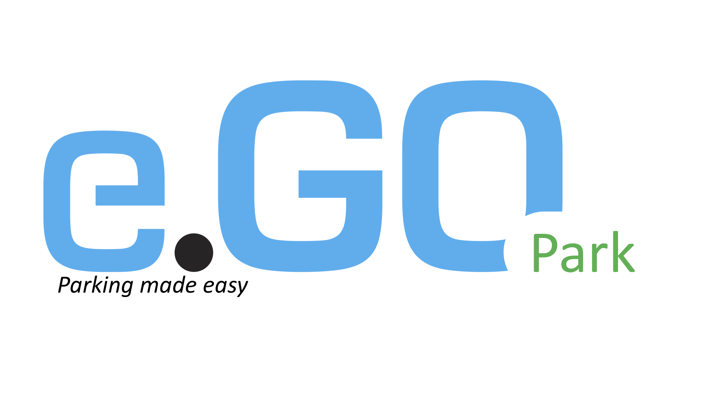

--- 
title: "e.GO Digital Hackathon"
author: "Team: Hugs for bugs (Xiaoqi, Yafei, Sachin, Venkatesh)"
date: "`r Sys.Date()`"
output:
  html_document:
    df_print: paged
description: This is a website demo for hachathon The output format for this example
  is bookdown::gitbook.
documentclass: book
link-citations: yes
bibliography: [book.bib]
site: bookdown::bookdown_site

---

# Background

Parking is understudied, yet imposes a similarly significant burden on drivers and the wider economy. In fact, this study shows nearly one in three drivers abandoned their search for a parking space at least once in the past year, as drivers spend an average of nearly nine minutes in pursuit of a coveted spot [@cookson2017impact].

**Problems**
- Searching for parking imposes a significant economic burden with drivers in the U.S., U.K. and Germany wasting 17, 44 and 41 hours a year respectively at an estimated cost of $72.7 billion, £23.3 billion and €40.4 billion a year in these countries.
- Unsurprisingly, the largest cities and major financial centers suffer the most with drivers in New York (107 hours), London (67 hours) and Frankfurt (65 hours) spending the most time searching for parking each year.
-  Paying for more parking time than required (“overpaying”) is a universal parking pain with drivers in the U.S., U.K. and Germany (costing $20.4 billion, £6.7 billion and €4.4 billion a year respectively).

**We need intelligent parking solutions -- e.GO Park & Pay**

```{r, egoPark, fig.align='center', fig.cap="e.GO Park logo" }

```
